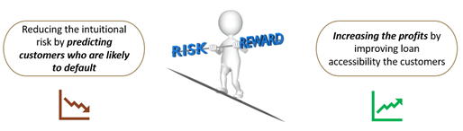

# Bank Loan Default Prediction

Bank loan default is a classic use case where ML models can be deployed to predict risky customers and hence minimize losses of the lenders. Financial industry is highly regulated, thus any model deployed or classification of customers basis their behavior, demographics etc. is highly regulated and must be explained to authorities to ensure unbiased operations.

Loans are risky but at the same time it is also a product that generates profits for the institution through differential borrowing/ lending rates.

The ML model should be explainable and be able to balance between risk and profits.

# How to run the App.

* Clone the repository to the [Katonic](https://katonic.ai/)'s VScode workspace.
* Install the requirements.txt using pip.
* ` streamlit run app.py --server.port=8088 --server.address=0.0.0.0 --logger.level error` run this command in the terminal.

* Then go to your workspace section and click on the `Live app` option.