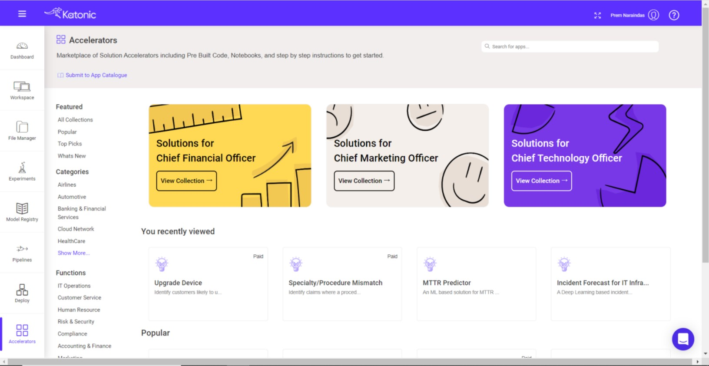
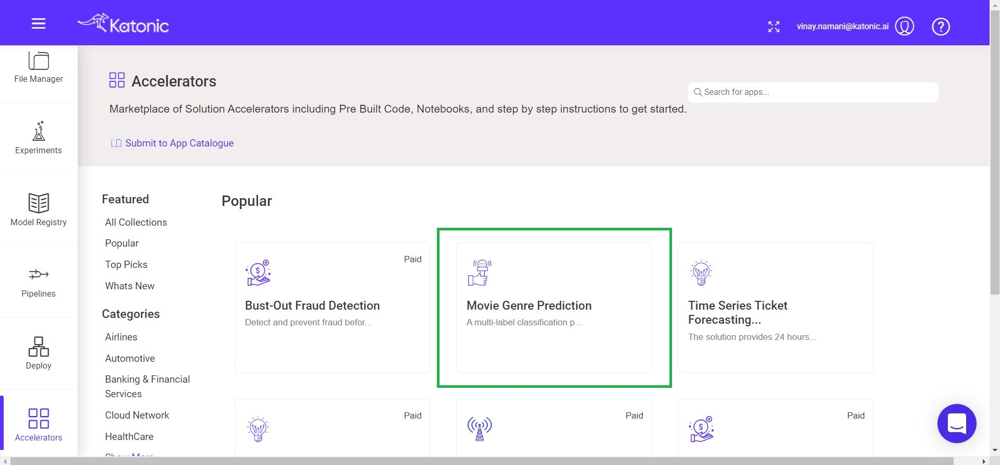
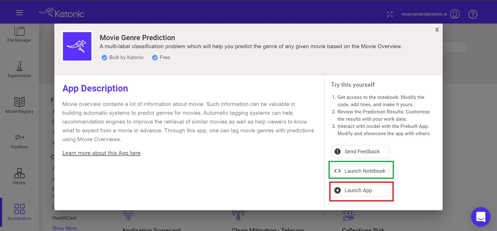

# Finding Pre-Built use case on Katonic Accelerators.

Before staring with any usecase on data science or in machine learning scenario. Let's have a look on Katonic's accelerators, If there is a similar pre-build use case in accelerators you can reuse it.

The usecase that we're going to build is already on the Accelerators, so use can clone the repository and use it for the demo purposes.
For that, Go to Accelerators on Katonic platfrom. There you can see most of the common usecases that are being used in the Data Science industry. Here you can got to the Popular and then find Movie Genre Prediction.

Once you find the Movie Genre Prediction use case click on it and go to `Launch Notebook` to find the Entire repository for the Application developement and click on `Laucnh app` to see the Deployed Application. 

You can use this application do the single prediction  for any movie overview.