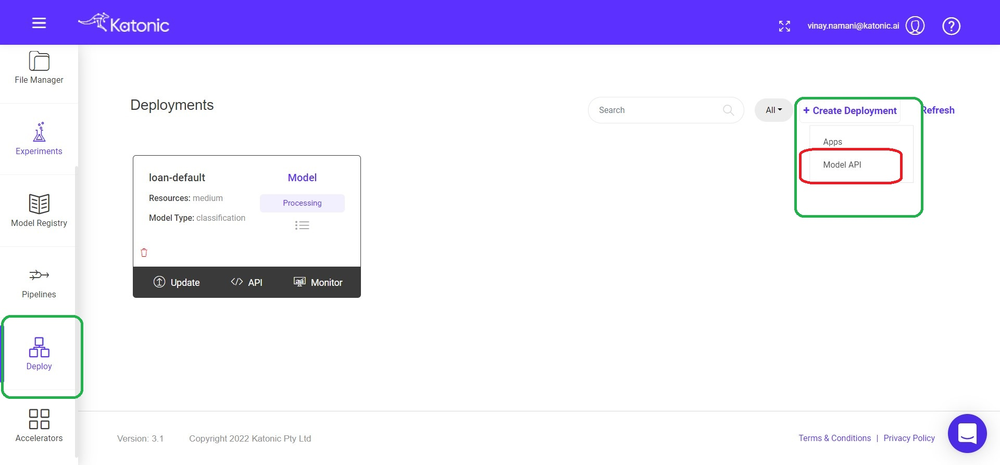
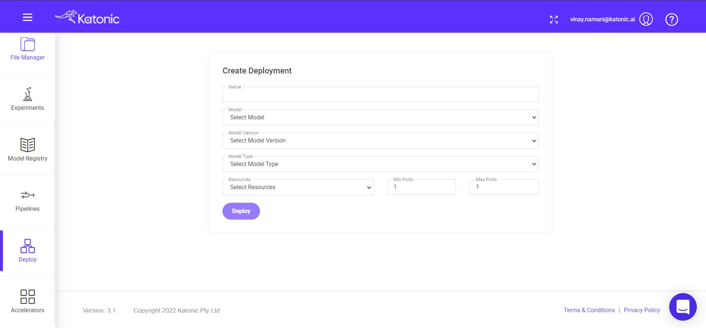
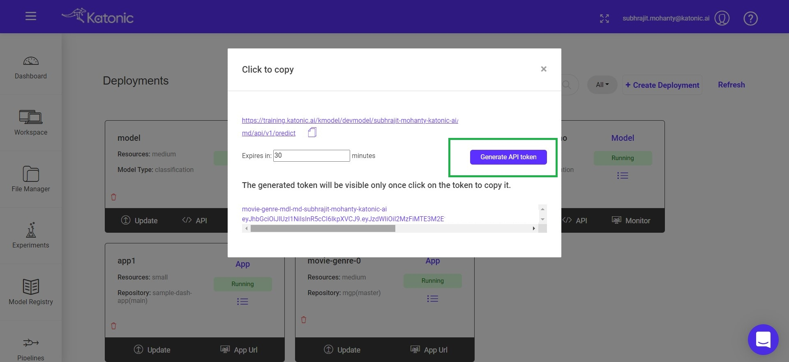

# Model Deployment

Once the Pipeline will get created. We had everything to deploy a model like pipeline , best model and artifacts.So We can deploy the model that we had choosen before and tagged that with Production stage.

Now we can deploy the model and get an API end point. Which we can use in several ways like using it for the Inference purpose or using in Web Application.

To Deploy the model you need to got to the Deploy section from the Katonic platform and click on create deployment and choose model API. Because we're just deploying model to get and API end point.

Once you click on the Model API option you'll get a window to choose which model you need to deploy and to choose the configuration for the model.

You need to provide some of the details to configure:

* Name : A name for your model that is going to be deployed.

* Model : Model name that we had given while registering it.

* Model Version : Which version of the model you want to deploy.

* Model Type : Choose the model like whether it was a Classification, Regression or any other like time series etc.

* Resources : The Amount of resources that you want to allocate to your model based on your requirement.

* Min & Max Pods : These will be used based on your model traffic or the number of requests that you're model will get. 

Then you need to click on Deploy to deploy your model.

It will take few minutes in order to Deploy the model, Because it will configure the Environment to run model continuously and also allocate the Resources. It will also assign a Monitoring Dashboard in order to find the Model Drift or Detoration.

Once the model is Deploying and Running you can see the Status of the model as RUNNING. There you can get an option to access the API endpoint.

You can use the above API for inference and in Web Application. But in order to use it you need an API TOKEN for the Authorization.

It will provide the Security element to your API endpoint. No one can access the it wihtout the TOKEN. To get the you need to provide the Expiry time for the API Token and click on Generate Api Token. This will give you an String type API that you can use.