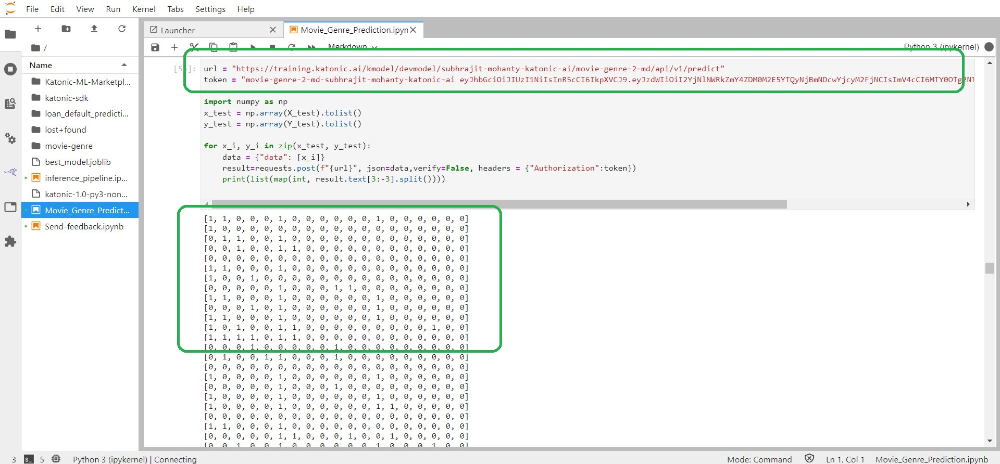
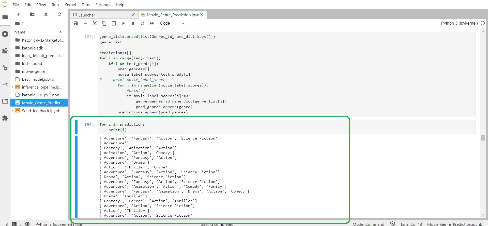

# Batch Inference 

Once the best model gets deployed, you'll get an API endpoint and an Authorization token to use the API in Web Applications and BI tools etc.

In this Batch Inference, we'll use the Previously cleaned data. So that we don't need to do the Preprocessing again. We can directly use it for the Inference. 

You need API end point along with the API token in order to do the Predictions.

Here, How can you do predictions using API token.

These are the Predited values for all the Genres if the belong to a Genre it will give an output 1, if not 0.

We can conver these lists to find out the Genre names.

