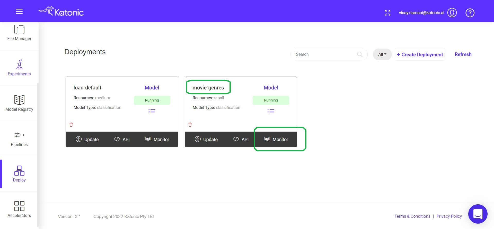
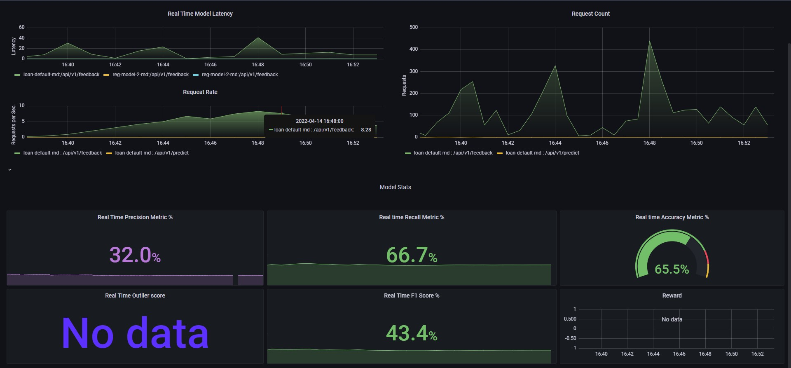

# Model Monitoring.

Now we have deployed our model and making predictions with that, we can even use it in the Web Application.

So keep track of the model performance, we need a monitoring facility to see how the model is working with the given data and is there any degradation or deterioration so that we can re-train the model using the Pipeline and deploy the next best model to the Production. In this way we can automate the Life Cycle of a Model.

To Monitor the model.

* Go to the Deployment section from the Katonic Platform sidebar.

* Find the model that you deployed.

* click on the Monitor Icon to view your model Performance and all the metrices regarding the Inference Data.

Once you click on the Monitor option, a new windows will be opened and it consists of all the Monitoring options. It consists of the following metrics and Performance indicators.

* Memory Usage
* CPU Usage
* Deployment Statistics

    * Real Time Model Latency
    * Request Count
* Model Statistics

    * Real Time Precision Metric
    * Real Time Recall Metric
    * Real Time Accuracy Metric
    * Real Time Outlier Score
    * Real Time F-1 Score 

* Model Monitoring Dashboard

Based on the Model performance that you're able to analyze from the dashboard. If you feel that model is getting degraded. You can simply run the pipeline in a single click and bring back a new model with the different data or more data.
