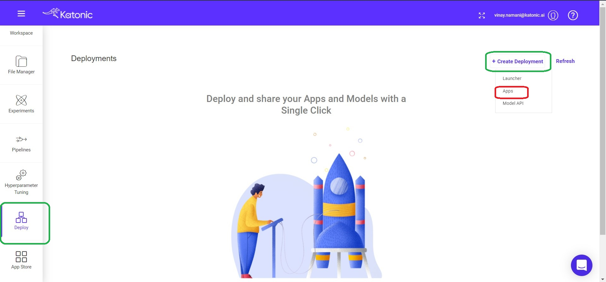

# Application Deployment

If you want to deploy an Application through the Katonic platform all you need to have is the GitHub token, In which the Application structure and all the required files present.

If you want to make a sample Deployment, You can use this [Link](https://github.com/katonic-dev/Katonic-ML-Marketplace/tree/master/Movie_Genre_Prediction_App) to clone your repository into your Github and use your GitHub [Token](https://docs.github.com/en/authentication/keeping-your-account-and-data-secure/creating-a-personal-access-token) to deploy the Application.

To deploy the application do to the deploy on Katonic platform. From there you need to click on create deployment and choose apps.

After you click on the Apps a window will get appreared and you need to define configuration for your application.

These are the Configuration Types.

* App Name : A name for your application.

* Evironment : The Type of Application you want to deploy.Whether it is a Streamlit app, Dash app , Shiny app or Voila app.

* [Github Token](https://docs.github.com/en/authentication/keeping-your-account-and-data-secure/creating-a-personal-access-token) : Enter your Github Token.

* Username : The Username will get displayed automatically when you paste the Github token, you can verify it by checking that the Github token and Username are getting matched.

* Account Type : You need to select whether the application you want to deploy is in Your Personnel repositories or in Organizational Repostories.

* Repository : Choose your application Repository.

* Branch : Branch in which your application is.

* Main File Path : The main file from where your application will get initiated.

* Resources : Select the Resources based on your application size and the traffic that application may get.

