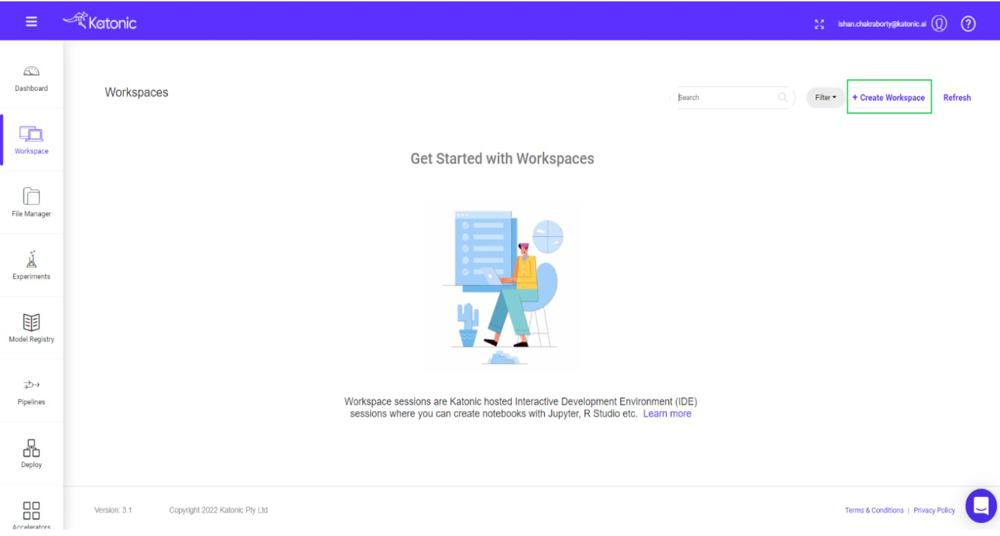
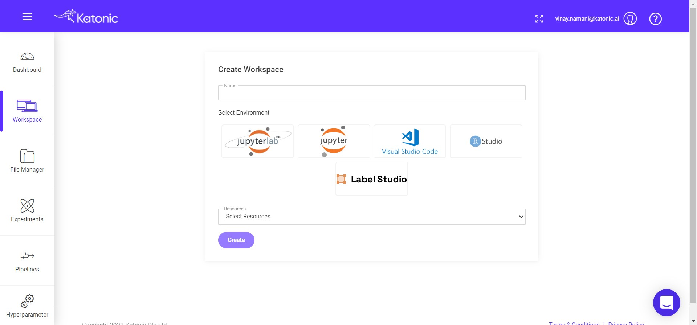
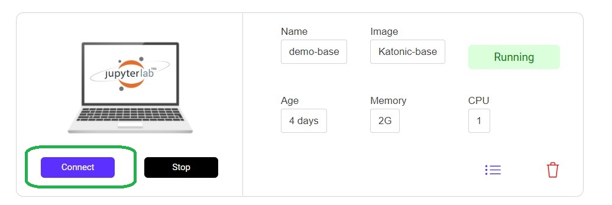

# Creating a Workspace on Katonic Platform.

Workspace sessions are interactive sessions hosted by Katonic, where you can interact with code notebooks like Jupyter, RStudio and VS Code. The software tools and associated configurations available in your session are called Workspaces.

To Create a Workspace on Katonic platform, First sign into the Katonic website then choose the workspace option from the Left side dashboard. From there you need to choose the Create Workspace option in order to create a workspace.

* Click on Create Workspace from in the workspace section.

* Select Jupyter or VS Code (based on your requirement).

    Before creating the workspace, you need to configure what type of environment, image and resources you want. If you want to work on jupyter notebooks, then you need to choose `Jupyter Lab`, for application developement choose `VS Code`. 

* Choose the Image.

    Choose the Image according to your purposes. Katonic-Base image will give you the ability to convert the notebooks into Pipelines through Katonic Pipeline Deployment Panel. The Sklearn, PyTorch, Tensorflow images will help you in the development stage, You don't need to install them Additionally. They will be pre-installed in the Notebook. 

* Select the Amount of resources you need to work on.

* Click on Create Workspace .

When you launch a workspace, a new containerized session is created on a machine in the required hardware tier with the configures environment. The workspace tool you requested is launched in that container, then you need to click on the connect option then browser is automatically redirected to the workspace’s UI when it’s ready.

