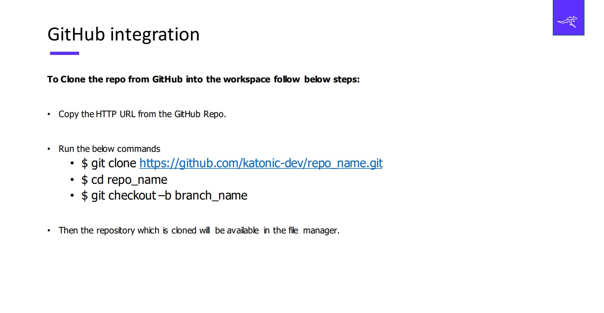

# Git Integration

To integrate with the Github simply launch a terminal from New Launcher and use the following commands to download the repository to your workspace. You can clone the repository that was shown in the Accelerators section to reuse it.

To clone the repository that we are going to show case in this demo. Use this [Link](https://github.com/katonic-dev/Katonic-ML-Marketplace/tree/master/Movie_Genre_Prediction_App)

When you use these commands to get integrated with git, you'll able to see the repository inside your workspace. Now you can get proceed with all the remaining operations based on the project life cycle.