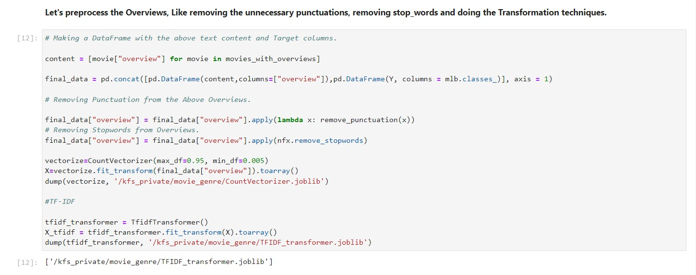

# Data preprocessing 
Once we cloned the repository into our workspace using Git Integration. You'll find a Notebook which will do certain operations like Scraping the data from [TMDB](https://www.themoviedb.org) using an API key.

These Scraping the data process will get all the Genres that are available in the database and fetch the movie overviews that assigned with the genres. There are some duplicate movies, So we need to remove all of them and keep the movies that associated with an overview. There will be no use if the movie dosen't contain any Overview. We need to make sure of that. Notebook will take care of all the Preprocessing things.

After getting the Genres and Overviews for the movies. We need to preprocess the Overviews because the Machine Learning won't get trained on the Raw text data. So we need to preprocess them like removing the unnecessary punctuations and convert them into some kind of features. We are doing these transformations in 3 different approaches.

* Count Vectorizer :  It is used to transform a given text into a vector on the basis of the frequency (count) of each word that occurs in the entire text. This is helpful when we have multiple such texts, and we wish to convert each word in each text into vectors (for using in further text analysis).​

* TF – IDF : It is also known as Term Frequency – Invert Document Frequency  of records. It can be defined as the calculation of how relevant a word in a series or corpus is to a text. The meaning increases proportionally to the number of times in the text a word appears but is compensated by the word frequency in the corpus (data).​

* Bag of Words : The Bag-of-Words model, or BoW for short, is a way of extracting features from text for use in modelling, such as with machine learning algorithms. The approach is very simple and flexible and can be used in a myriad of ways for extracting features from documents.​

