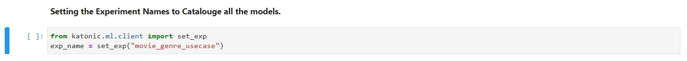
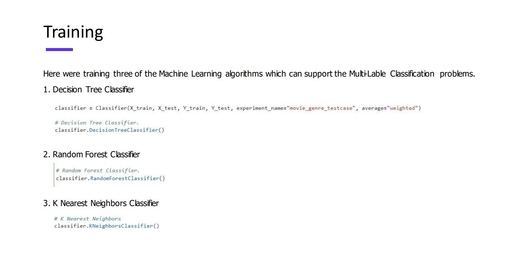

# Model Experiments.

Data scientists have access to many libraries and packages that help with model development. Some of the most common for Python are XGBoost, Keras, and scikit-learn. These packages are already available in the Katonic SDK(auto ML).

Once we completed doing the Text preprocessing like removing unnecessary punctuations, symbols and converted those text into numerical features. We need to use them to build Machine Learning models. For that we are going to Katonic's Auto ML tool which will keep track of all your experiments that you're doing inside a Notebook and store them in a Experiments Registry from there we can compare different models and find the best model.

Before doing any model training in the Notebook you need to set an experiment using katonic auto ml package.

The models that you're going to train will get stored under the Experiment name that you given.

We are using three of the most commanly used machine learning algorithms for these text classification usecase.

* Decision Tree Classifier.

* Random Forest Classifier.

* K Nearest Neighbor Classifier.

