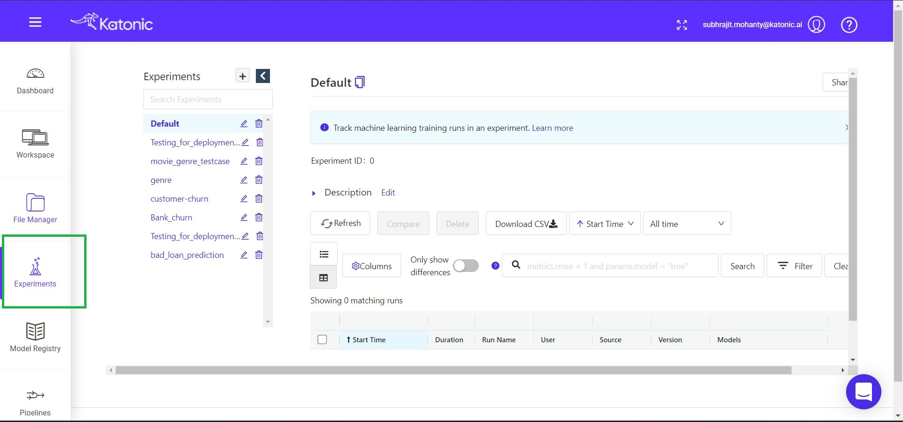
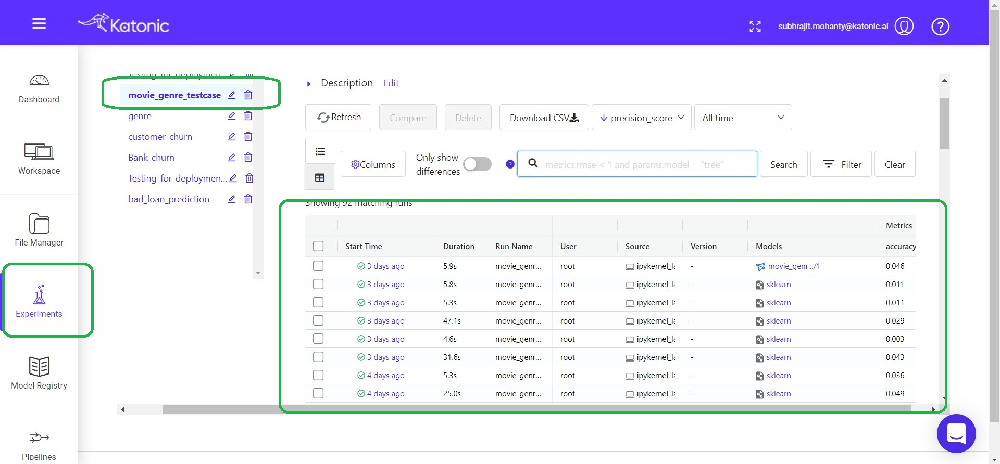
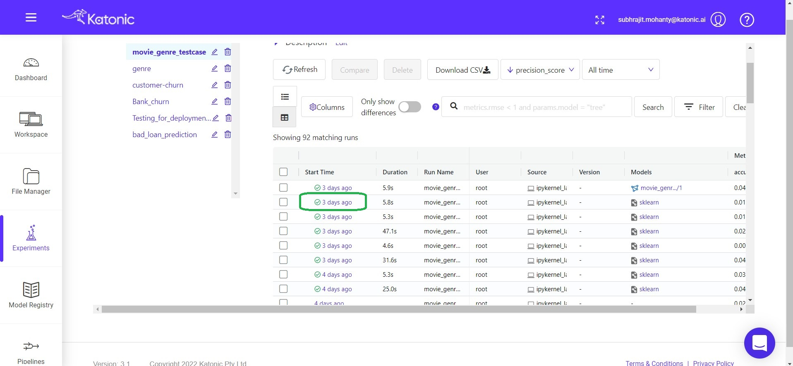
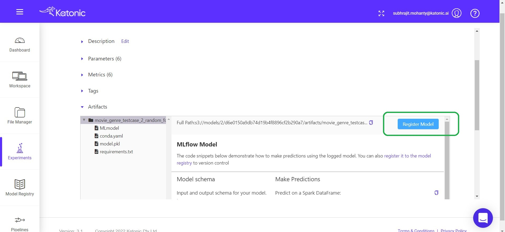
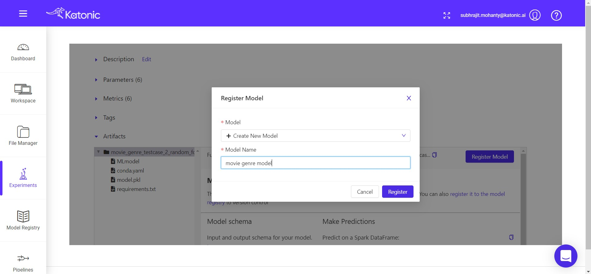

# Experiment Registry.

All the models that we trained in our notebook using Katonic Auto ML package, will get catalogued in the Experiment registry. 

To access the the Experiment catalogue you need to click on the Experiments tab on the Left sidebar.

By using this Experiment Registry you can evaluate the models based on their performance by looking at their metrices. Also you can do the comparision in between the models. Once you find your best model you can register the model and use it for Staging and Production purposes.

You can find all the Experiments that you've done in the workspace will shown here.You need to choose the current experiment to view all the models that are trained.

You can even see that versioning of the models in case you train the same model several times. It include most of the popular evaluation metrics like accuracy score, precision score, recall score, f-1 score etc. You can use these metrics to evaluate the models to find the best model in your experiment.

Once you've completed all the training things and got your best model by analyzing their performances using the metrics in Experiments registry.

You can simply register the model, so that it can send to Staging level or Production level. 

Note: Without registering the Model you cannot Productionize the model.

# Steps to Register the model.

* So, once you find the best model based on the metrics, simply click on the time label of the particular model.

* after that choose the register model option.

* Then you need to choose create new model and choose a name for it. Then it will get registered. So, that you can use in Production.

Once you registered the model you can see it in the Model Registry.

