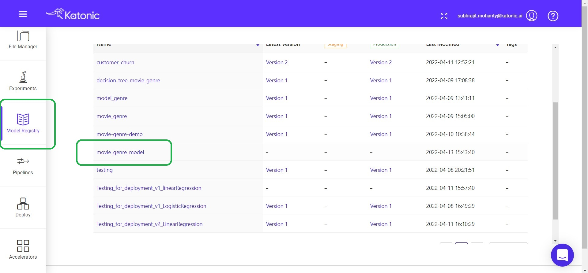
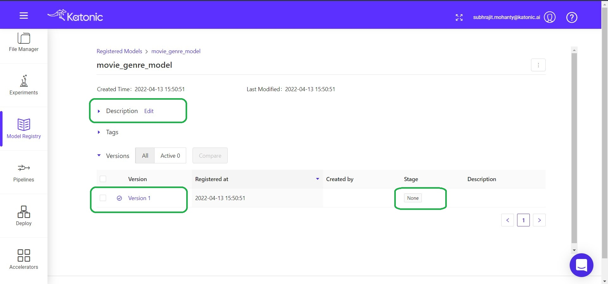
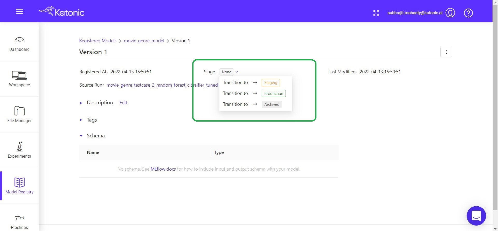

# Model Registry

Once you've completed all the training things and got your best model by analyzing their performances using the metrics in Experiments registry. Then you need to register the model.

Now you can deploy the model that you've registerd from model registery tab.

From that click on the model that you've registered previously.

Once you click on the registered, you can see various details about the model. Like the model version, registered time, model's current stage and model training time.

Different stages for a model.
* None - Model is registered but not under staging or production

* Staging - If the model is in Staging, the Quality Analyzing team can check the performance of the model and do various type of test cases to measure the model capabilities and scalability. If they're satisfied with the performance they can move it Production.

* Production - If you want to send the model into Production Environment you need to choose the production. Then it can used through a model api or it can be used in Web Applications.

Note: You can deploy a model only when it is with the Production tag.

Once you tagged a model with Production then you can use it in deployement.
