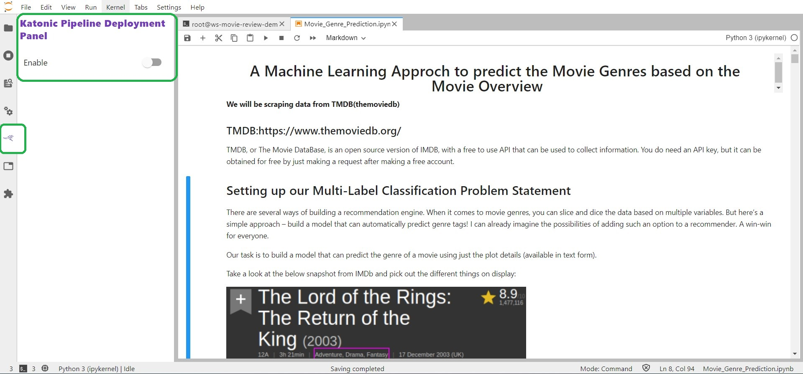
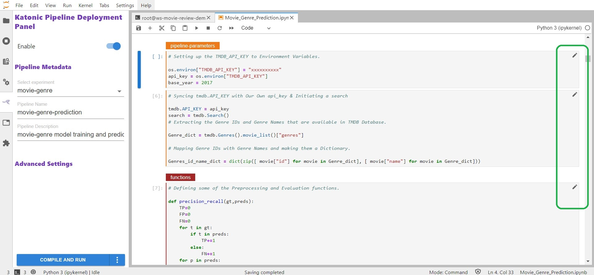

# Notebook Conversion to Pipeline.

Before deploying a model to production, we will create a pipeline by converting the notebook. For that we'll use Katonic's Pipeline Deployment Panel.

So just go to the Notebook and enable the Katonic Pipeline Deployement options. You can find this option in the left sidebar of your notebook.

Once you enable the Deployment panel. You can see that every cell in the notebook will have an edit option (pencil marker) to tag the cell based on the functionality it will do. If it has any dependency on other cell we need to select the dependency also to make it work.

Available Cell Types :

|Cell type	| Cell should contain|
|-----------|----------------------------------------------------------------------------------------------------------------------------|
|Imports	| Blocks of code that import other modules your machine learning pipeline requires and may be needed by more than one step.|
|-----------|----------------------------------------------------------------------------------------------------------------------------|
|Functions	|  Functions used later in your machine learning pipeline; global variable definitions (other than pipeline parameters); and code that initializes lists,|
|           |  dictionaries, objects, and other values used throughout your pipeline.|           
|---------|------------------------------------------------------------------------------------------------------------------------------|
|Pipeline Parameters	| Definitions for global variables used to parameterize your machine learning workflow. These are often training hyperparameters.|
|---------|------------------------------------------------------------------------------------------------------------------------------|
|Pipeline Metrics | Lines of code that log or print values used to measure the success of your model.|
|---------|------------------------------------------------------------------------------------------------------------------------------|
|Pipeline Step | Code that implements the core logic of a discrete step in your workflow.|
|---------|------------------------------------------------------------------------------------------------------------------------------|
Skip Cell |	 Any code that you want to ignore.|

Once you tag all the Cell along with their Dependencies, you can compile and run the pipeline.

