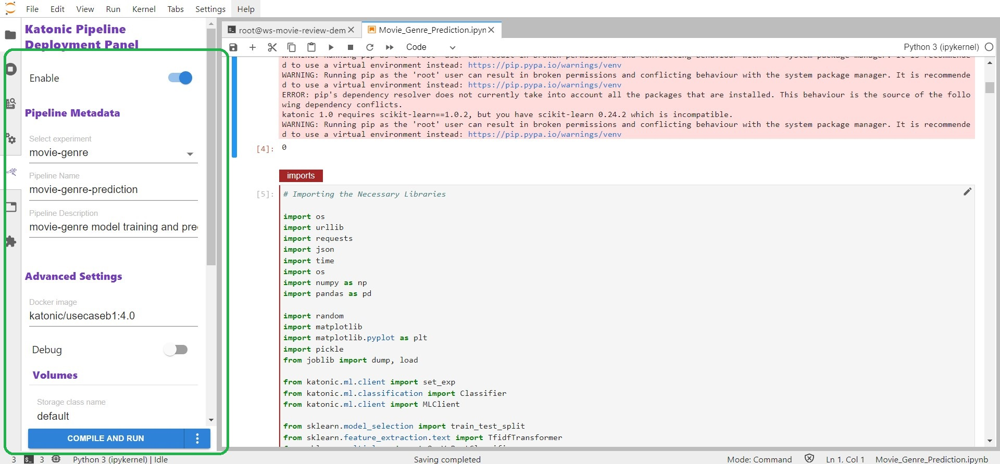
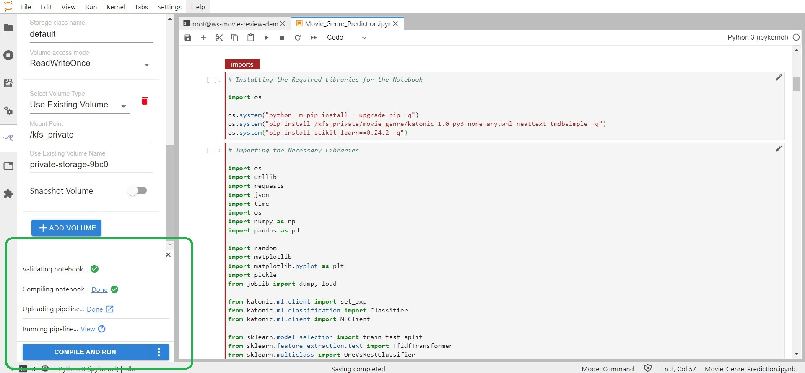
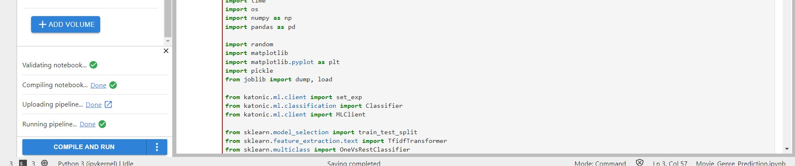
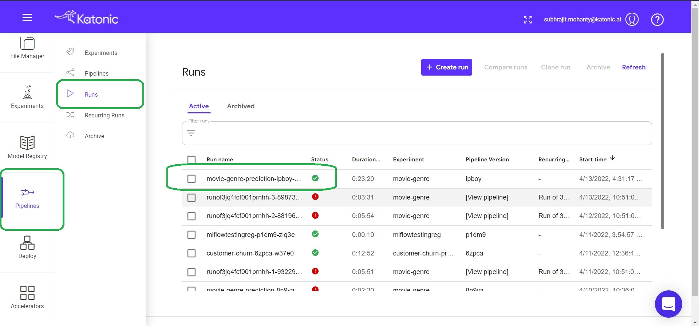
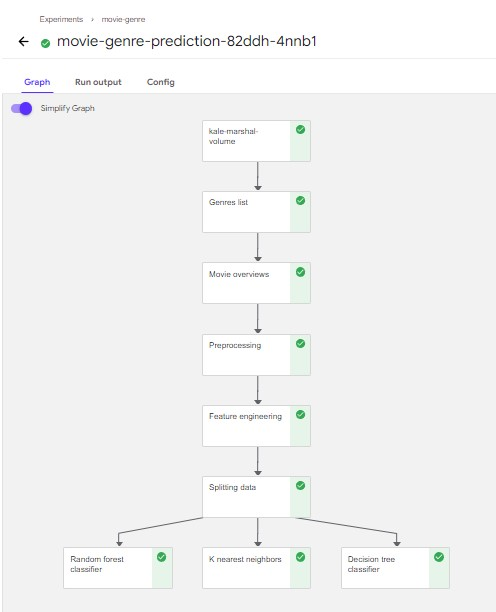

# Executing the Pipeline

In this section, we describe how to run a pipeline you created using the Katonic Automated Pipeline Deployment JupyterLab extension and summarize how Katonic Automated Pipeline Deployment organizes and executes pipeline steps.

How to Run a Pipeline

To run an annotated notebook as a pipeline using Katonic Automated Pipeline Deployment:
1.	Enter a name in the Select experiment field under the Pipeline Metadata heading or select an existing name from the pull-down menu. Katonic Automated Pipeline Deployment enables you to group multiple pipeline runs together under the same experiment name. This simplifies comparisons across pipeline runs.

2.	Enter a name in the Pipeline Name field. Katonic Automated Pipeline Deployment will use this name to identify your pipeline when producing output from a pipeline run, when creating snapshots.

3.	(Optional) Enter a description in the Pipeline Description field.

4.	Click the COMPILE AND RUN button at the bottom of the Katonic Automated Pipeline Deployment Panel.

 

When you click COMPILE AND RUN Katonic Automated Pipeline Deployment will do the following:

If you want to see the running pipeline, you can see it from the running pipeline option at bottom left section.

Once the Execution of Pipeline is done the running pipeline option we get changed into Running pipeline DONE.

Then click on the the Pipeline tag from the Platform sidebar and then click on runs.

If you click on your pipeline you can find out all the deatils regarding your pipeline along with the Graph.

